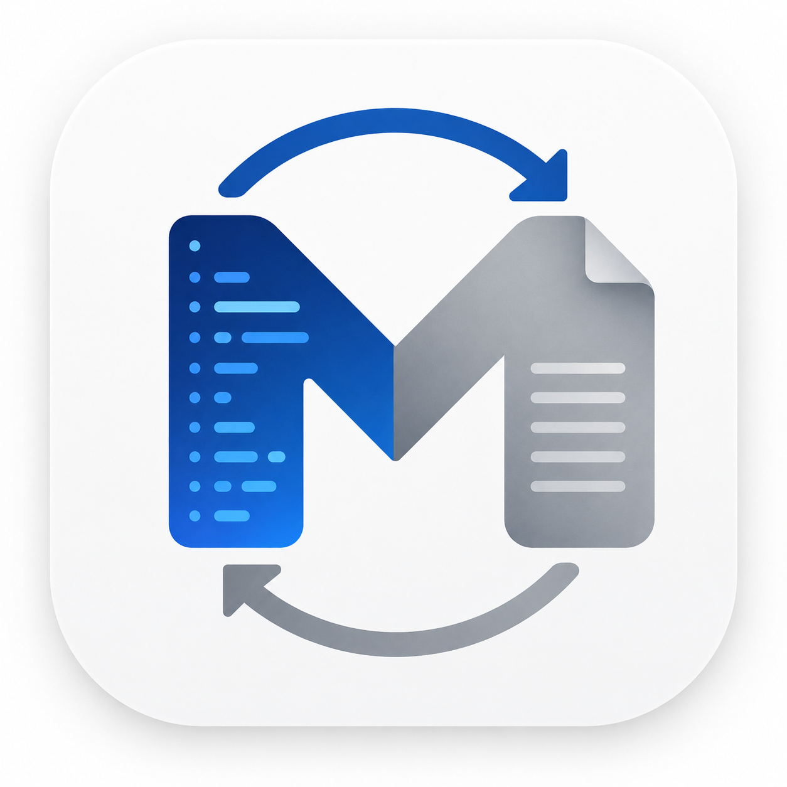

<div align="center">



# ApexMark

**Markdown / WPS clipboard / HTML — one tap**

[](https://github.com/raymondx-byte/ApexMark/releases/latest)
[](https://www.gnu.org/licenses/agpl-3.0)
[](#开源协议--license)
[](https://developer.android.com)
[](https://kotlinlang.org)
[](https://developer.android.com/jetpack/compose)
[](https://github.com/raymondx-byte/ApexMark/actions/workflows/build.yml)

### 10 秒了解

把 **ChatGPT / Claude / Gemini** 里复制的 **Markdown**，一键变成能粘进 **微信、飞书、WPS** 的富文本（表格线框、加粗、代码底色尽量保留）。**不注册、不联网、不后台读剪贴板**；APK **约 1.6 MB**。

| 你要粘到 | 点菜单里的 | 说明 |
|----------|------------|------|
| **微信、Telegram、多数聊天** | **→ HTML**（Markdown 剪贴板时多为**右/次**按钮） | 浏览器式 `text/html` 剪贴板，**没有**临时 `.html` 文件 URI，避免聊天气泡里多出一个 **附件**。 |
| **WPS / 手机 Office（WPS 内核）** | **→ WPS**（多为**左/主**按钮） | 首项带 **FileProvider** 的完整 HTML 文件，WPS 才按「文档」吃满版式。 |

两条形态 **无法** 同时对「聊天 + WPS」都做到各家 App 的极限——这是各 App 对 `ClipData` 取舍不同，**不是疏忽**。需要两边都试时：**各转换一次**即可。

📋 **[完整更新记录（CHANGELOG）](CHANGELOG.md)** · 🧪 **CI**：push / PR 自动 `assembleDebug` + `test`

### 📥 [**Download the latest APK →**](https://github.com/raymondx-byte/ApexMark/releases/latest)

[简体中文](#简体中文) · [English](#english) · [Releases](https://github.com/raymondx-byte/ApexMark/releases) · [Issues](https://github.com/raymondx-byte/ApexMark/issues)

</div>

---

## 简体中文

### 这是什么？

从 AI 聊天工具（ChatGPT、Claude、Gemini……）复制的回答都是 **Markdown 纯文本**，直接粘贴到微信、飞书、钉钉、WPS 时排版全部丢失——代码块变纯文字、表格没有框线、加粗斜体全部消失。

**ApexMark** 解决的就是这个痛点：**复制 → 点一下 → 得到 WPS / HTML / Markdown 剪贴板**。

版本与变更说明见 **[CHANGELOG.md](CHANGELOG.md)**（当前示例构建：`ApexMark.1.1.1.apk`，体积仍约 **1.67 MB** 量级）。

它是一个**极轻量的"转换流"工具**，嵌入系统各个层级，随时待命。安装包小、内存占用低、零后台开销 —— 它不抢资源，只在你点击时工作。

| 入口        | 操作                       | 场景      |
| --------- | ------------------------ | ------- |
| **悬浮球**   | 短按弹出 **→ WPS / → HTML / → MD**，长按打开主界面 | 全局任何界面  |
| **通知栏** | 系统样式行内仅 **一行居中提示**（随系统语言）；点按后进二级菜单（与悬浮球同款双键） | 状态栏小图标为透明占位，展开区无营销文案 |
| **分享菜单**  | 从其他 App 分享文本进来           | 系统分享入口  |
| **主界面**   | 打开 App 直接双向转换             | 最直接的方式  |

### 设计理念

| 维度       | 目标                                                |
| -------- | ------------------------------------------------- |
| **核心痛点** | AI 时代 Markdown 与移动办公套件（微信/WPS/飞书）之间的格式鸿沟           |
| **核心能力** | 剪贴板格式互转：**Markdown ↔ WPS 剪贴板 ↔ HTML**（必要时双 MIME / FileProvider） |
| **设计原则** | 极轻量 · 低资源 · 零网络 · 零追踪 · 零后台监听 · 100% 本地 · 触发即用 |

### 核心特性

#### 🔄 转换引擎 (Apex-Link)

- 基于 [Flexmark-java](https://github.com/vsch/flexmark-java) 的高性能 Markdown ↔ HTML 双向解析
- **全内联 CSS** — 不依赖 `<style>` 标签，确保第三方 App 正确渲染
- **表格强制框线** — `<table border="1" cellpadding="5">` + 每个 `<td>` 独立 border
- **微信/WPS 深度兼容** — `<table border="1" cellpadding="5">` + 每格内联边框；**默认表格无彩色填充**（透明底、黑色线框，易读不抢色）
- **双格式剪贴板与纯文本槽** — 同时写入 HTML + Plain；WPS 与邮件向 HTML 输出时 Plain 槽为渲染正文，避免 `#`、`**` 等 Markdown 源码污染纯文本粘贴；三个及以上连续换行压缩为段落间的一个空行
- **纯文本剪贴板** — 被识别为「仅纯文本、非 Markdown/HTML」时，**主界面**两个按钮或**通知栏二级菜单**内两个选项均只做**空行整理**（连续空行合并为段落间单行空行），直接写回 `text/plain`，不跑版式转换
- **反向转换** — HTML / WPS 剪贴板内容 → Markdown，把网页或文档快速结构化
- **版式与来源** — 非规范或杂乱来源可能无法完整还原富文本；无法合理转换时，剪贴板仍会尽量保留原文中的可读纯文本

#### 🫧 悬浮球 + 通知栏 (Floating Portal)

- 品牌 Logo 圆形悬浮球，自由拖动 + 自动贴靠 + 半隐藏
- **短按**打开转换菜单（**→ WPS / → HTML / → MD**）· **长按**打开 ApexMark，带触觉反馈
- **通知栏常驻**：`RemoteViews` **整行可点**，仅展示 **本地化「点击转换文本」** 提示；`setSmallIcon` 使用透明矢量以弱化状态栏占位；点击后经透明 Activity 判型，弹出与悬浮球相同风格的 **半透明二级菜单**
- **前台直转**：App 在前台时直接调用引擎，杜绝任务切换动画
- **省电优化** — 灭屏自动隐藏并暂停所有动画，常驻状态零定时器、零轮询

#### 🎨 软件美学

- **明 / 暗双主题** — 跟随系统或手动切换
- **品牌色谱** — 源自图标深蓝渐变 (`#0050B0` → `#3380E0`)
- 暗色模式采用 **深蓝灰**（非纯黑），保留品牌色温
- Material 3 设计语言 + 统一圆角体系

#### 🌐 多语言

支持 12 种语言：英文、简/繁中文、日、韩、法、德、意、俄、葡、西、阿。

#### 🪶 轻量 & 低资源

**Release APK 体积（本机构建）**：`./gradlew :app:assembleRelease` 产物约 **1.67 MB**（当前 `versionName` 下输出名为 `ApexMark.1.1.1.apk`；R8 全模式 + `minifyEnabled` + `shrinkResources`）。

**运行时指标（PSS / CPU 等）** 与机型、ROM、是否工作资料、是否开启悬浮球强相关，**不能由仓库代测唯一真值**。下表为历史真机 `dumpsys` / `top` 采样示例（App 已启动悬浮球、切后台约 30s 后），**仅作数量级参考**；请务必用下方 **adb 指令在你自己的设备上复测**。

| 指标 | 参考示例（历史采样） |
|------|---------------------|
| **稳态 CPU**（后台 idle） | **0.0%** 量级（短时 `top` 采样） |
| **稳态 PSS** | **约数十 MB**（含大量系统共享映射；看 `TOTAL PSS` 与 `Private Dirty`） |
| **AlarmManager / JobScheduler** | 预期无业务闹钟与 Job（可用 `dumpsys` 检索包名验证） |

##### 资源占用自测指令（adb）

前置：手机打开 **USB 调试**，PC 安装 [Platform Tools](https://developer.android.com/tools/releases/platform-tools)；在 App 内 **启动悬浮球** 后按 Home 回到桌面，等待 **30s** 再测（进程常驻、稳态更接近真实使用）。

**PowerShell（Windows，仓库根目录）** — 测量本机编译出的 APK 字节数：

```powershell
(Get-Item .\app\build\outputs\apk\release\*.apk | Select-Object -First 1).FullName
[math]::Round((Get-Item .\app\build\outputs\apk\release\*.apk | Select-Object -First 1).Length / 1MB, 2)
```

**adb 与包名**（多用户 / 工作资料若报错，可加 `--user 0` 或先 `adb shell pm list users`）：

```powershell
$pkg = "com.apexmark"
adb devices
adb shell pm path --user 0 $pkg
adb shell dumpsys meminfo $pkg
adb shell "ps -A | grep $pkg"
adb shell "top -b -n 5 -d 1 2>/dev/null | grep -i apexmark || true"
adb shell dumpsys alarm | findstr /i apexmark
adb shell dumpsys jobscheduler | findstr /i apexmark
adb shell dumpsys batterystats --charged $pkg
```

说明：`dumpsys meminfo` 在进程未启动时会提示 `No process found`，属正常；`top` 在部分 ROM 上参数不同，可改用 `adb shell pidof $pkg` 拿到 PID 后再查 `/proc/<pid>/status`。

**Bash（macOS / Linux）**：

```bash
PKG=com.apexmark
ls -lh app/build/outputs/apk/release/*.apk
adb shell pm path --user 0 "$PKG"
adb shell dumpsys meminfo "$PKG"
adb shell dumpsys alarm | grep -i apexmark || true
adb shell dumpsys jobscheduler | grep -i apexmark || true
adb shell dumpsys batterystats --charged "$PKG" | head -n 80
```

代码层保证：

- **常驻态无轮询** — Service 不使用 `Timer` / `WorkManager` / 协程周期轮询；剪贴板触发的通知 UI 仅 **Handler 短延迟合并**（非周期）
- **事件驱动唤醒** — 仅注册 `ACTION_SCREEN_ON/OFF` 两个系统广播；其余唤醒全部来自用户触摸或通知栏点击
- **灭屏自动节流** — 悬浮球在屏幕关闭瞬间 `visibility=GONE`、所有 `Animator` 立即 `cancel()`
- **共享转换引擎** — Service / 透明 Activity / MainActivity 共用 `MarkdownConverter`（内部委托 `:apex-link-core` 的 Flexmark 管线，避免重复初始化成本高的 parser）。
- **前台直转优化** — App 在前台时直接调用引擎，跳过透明 Activity 桥接，零任务切换开销
- **单一前台 Service** — 只为通知栏常驻保留一个轻量 Service，无 IPC、无额外进程、无 worker
- **通知 UI 防抖** — 剪贴板变化等高频触发在主线程 **短延迟合并** 为单次 `startForeground` 更新同一通知 ID，避免连续 `notify` 与多余 Binder 调用
- **冷启即用** — 进程一启动就在 main looper 首位排队启动通知，毫秒级可用

#### 🛡️ 安全 & 隐私

- 所有转换 **100% 本地执行**，零网络请求，零数据上传
- 仅在用户主动点击时读取剪贴板，不监听后台
- 超过 1MB 的内容自动拒绝同步处理，防止卡死
- 大文本异步转换，UI 始终响应

### GitHub Release（打 tag 自动发版）

推送 **`v*`** 标签会触发 [`.github/workflows/release.yml`](.github/workflows/release.yml)：在 Runner 上解码 keystore、写入 `keystore.properties`、执行 `:app:assembleRelease`，并把 APK 与 **SHA-256** 清单挂到 GitHub Release。

在仓库 **Settings → Secrets and variables → Actions** 中配置：

| Secret | 含义 |
|--------|------|
| `ANDROID_KEYSTORE_BASE64` | Release keystore 文件的 **base64**（整文件编码，一行） |
| `KEYSTORE_PASSWORD` | Keystore 密码 |
| `KEY_ALIAS` | 密钥别名 |
| `KEY_PASSWORD` | 密钥密码 |

本地发版仍可只用根目录 `keystore.properties`（勿提交）；CI 与本地二选一即可。

```bash
git tag v1.2.0
git push origin v1.2.0
```

### 架构

```
apex-link-core/                     # JVM 库：ApexLinkMarkdownCore + StyleStyler（Flexmark 管线，无剪贴板 API）
com.apexmark/
├── engine/
│   └── MarkdownConverter.kt        # Android 剪贴板 + 判型；富文本串转换委托 apex-link-core
├── service/
│   ├── FloatingPortalService.kt    # 悬浮球 + 通知栏前台 Service
│   ├── ClipboardConvertActivity.kt # 桥接 Activity (Android 10+ 剪贴板访问)
│   ├── ClipboardPeekActivity.kt    # 悬浮球判型用透明 Activity
│   └── NotificationMenuActivity.kt # 通知「点击转换」→ 二级菜单
├── ui/
│   ├── ConvertMenuUi.kt            # 通知/悬浮球二级菜单半透明样式（共享）
│   └── …                           # Compose 主题与组件（Material 3）
├── receiver/
│   └── QuickActionReceiver.kt      # 快捷指令广播
└── MainActivity.kt                  # 主入口 + 权限引导 + About / 主题
```

### 技术栈

| 类别          | 技术                                                 |
| ----------- | -------------------------------------------------- |
| 语言          | Kotlin 2.0                                         |
| UI          | Jetpack Compose + Material 3                       |
| Markdown ↔ HTML | Flexmark-java（引擎实现于 `:apex-link-core`） |
| 包体大小（release） | **约 1.67 MB**（本机 `assembleRelease` 实测）            |
| 最低系统        | Android 8.0 (API 26)                               |
| 目标系统        | Android 14 (API 34)                                |

> **`:apex-link-core`**：纯 JVM 子模块，便于在其它 Kotlin/JVM 项目里 `include` 复用；**尚未**发布到 Maven Central（若日后发布会在本文件记录）。

### 构建

```bash
git clone https://github.com/raymondx-byte/ApexMark.git
cd ApexMark
./gradlew assembleDebug         # debug APK
./gradlew test                  # 单元测试（`:app` + `:apex-link-core`）
./gradlew assembleRelease       # 已签名 release APK（需 keystore.properties 或 CI Secrets，见上「GitHub Release」）
```

### 安装

ApexMark 通过 **GitHub Releases** 分发，**不上架** Google Play / 国内应用商店。

📥 **[点此下载最新版 APK](https://github.com/raymondx-byte/ApexMark/releases/latest)**（约 1.67 MB，以 Releases 页实际文件为准）

1. 打开 [Releases 页](https://github.com/raymondx-byte/ApexMark/releases)
2. 下载最新版 release APK（约 1.67 MB，随构建略有浮动）
3. 在手机上打开 APK 文件
4. 首次安装时，系统会提示「来自此来源的应用」未授权 → 允许即可
5. 安装完成后按 App 内引导授予「悬浮窗」权限

> 因为没走应用商店审核，可以从签名指纹核验来源是否被篡改：
> SHA-1: `89:29:AA:01:2F:AD:A9:0E:6B:57:7E:56:A6:1D:AA:F0:3E:C2:18:FF`
> 在手机上安装后查看「设置 → 应用 → ApexMark → 应用详情 → 应用签名」对比即可。

### 使用方法

1. 打开 ApexMark，按提示授予 **悬浮窗权限**
2. 点击「启动悬浮球」— 悬浮球与通知栏转换入口同时就绪
3. 从任意应用复制 **Markdown、网页 HTML、WPS 剪贴板内容或纯文本**
4. 在悬浮球菜单或通知栏二级菜单中选择转换：**要粘微信等多用「→ HTML」**；**要粘 WPS 用「→ WPS」**；若剪贴板为网页 HTML 或 WPS 富文本，选 **→ MD** 可得结构化 Markdown
5. 粘贴到微信 / WPS / 飞书 / 钉钉

### 兼容性测试

| 目标 App | 表格框线 | 代码底色 | 加粗/斜体 | 链接  |
| ------ | ---- | ---- | ----- | --- |
| 微信聊天   | ✅    | ✅    | ✅     | ✅   |
| WPS 文档 | ✅    | ✅    | ✅     | ✅   |
| 飞书文档   | ✅    | ✅    | ✅     | ✅   |
| 钉钉聊天   | ✅    | ⚠️   | ✅     | ✅   |
| 邮件客户端  | ✅    | ✅    | ✅     | ✅   |

### 权限说明

| 权限                              | 用途                   | 必须？ |
| ------------------------------- | -------------------- | --- |
| `SYSTEM_ALERT_WINDOW`           | 显示悬浮球                | 可选  |
| `FOREGROUND_SERVICE`            | 保持悬浮球/通知服务存活         | 必须  |
| `FOREGROUND_SERVICE_SPECIAL_USE`| Android 14+ 前台 service | 必须  |
| `POST_NOTIFICATIONS`            | 通知栏转换按钮 (Android 13+) | 必须  |

**隐私承诺**：ApexMark 不联网、不上传、不后台读取剪贴板。所有操作仅在用户主动触发时执行。

---

## English

### What is ApexMark?

When you copy answers from AI chat tools (ChatGPT, Claude, Gemini…) and paste them into WeChat, Feishu, DingTalk, WPS, or any editor that expects styled paste, all formatting is lost — code blocks become plain text, tables lose their borders, bold/italic vanish.

**ApexMark** solves this in one tap: **copy → tap → get a WPS, HTML, or Markdown clipboard**.

Release notes: **[CHANGELOG.md](CHANGELOG.md)**. Example artifact name: `ApexMark.1.1.1.apk` (~**1.67 MB**).

| Paste into | Choose | Why |
|------------|--------|-----|
| **WeChat, Telegram, most chat boxes** | **→ HTML** (often the **secondary** action when the clip is Markdown) | Browser-style `text/html` clipboard **without** a temporary `.html` URI item — avoids an **extra attachment** bubble. |
| **WPS / mobile Office (WPS engine)** | **→ WPS** (often the **primary** action) | First `ClipData` item is a **FileProvider** HTML document URI so WPS keeps full layout fidelity. |

You generally **cannot** maximize both behaviors with a single clipboard write — different apps prioritize different MIME / URI items.

It is a **featherweight "conversion pipe"** woven into every system layer. Small footprint, low memory, zero background work — it never steals resources and only runs when you tap.

| Entry point      | Action                                | Scenario          |
| ---------------- | ------------------------------------- | ----------------- |
| **Floating bubble** | Tap opens **→ WPS / → HTML / → MD**; long-press opens ApexMark | Any screen, anywhere |
| **Notification** | One **centered line** of localized hint text; tap opens the same secondary menu as the bubble | Status-bar slot uses a **minimal transparent** small icon; expanded custom view has no extra branding text |
| **Share menu**      | Receive text from any app              | System share intent |
| **Main screen**     | Bidirectional one-tap                  | Most direct       |

### Design philosophy

| Dimension      | Goal                                                                          |
| -------------- | ----------------------------------------------------------------------------- |
| **Pain point** | The format gap between AI-era Markdown and mobile office suites               |
| **Core**       | Clipboard formats: **Markdown ↔ WPS clipboard ↔ HTML** (dual MIME / FileProvider where needed) |
| **Principles** | Lightweight · low-resource · zero network · zero tracking · zero background polling · 100% local |

### Key features

#### 🔄 Conversion engine (Apex-Link)

- High-performance bidirectional Markdown ↔ HTML powered by [Flexmark-java](https://github.com/vsch/flexmark-java)
- **Fully inlined CSS** — no `<style>` blocks, every third-party renderer cooperates
- **Hardened tables** — `<table border="1" cellpadding="5">` plus inline `<td>` borders
- **WeChat / WPS friendly** — hardened `<table border="1" cellpadding="5">` plus inline cell borders; **neutral default tables** (transparent fills, black borders) instead of tinted headers
- **Dual clipboard + plain-text slot** — HTML + Plain together; WPS- and email-style HTML fills the Plain MIME with rendered body text so plain-text pastes stay free of Markdown marker noise (`#`, `**`, …); three or more consecutive newlines collapse to a single paragraph break (one blank line)
- **Plain-text-only clipboard** — when content is classified as plain text (not Markdown or HTML), **both options** in the main screen row or in the **notification’s secondary menu** only **tidy blank lines** (runs of empty lines collapse to a single blank line between paragraphs) and write `text/plain` back—no styled conversion pipeline
- **Reverse conversion** — HTML or WPS clipboard back to clean Markdown
- **Layout vs. sources** — informal or messy markup may not fully preserve rich layout; when a faithful conversion is not possible, readable plain text is still preserved on the clipboard

#### 🫧 Floating bubble + persistent notification

- Branded circular bubble, draggable, auto-snap, half-hidden idle state
- **Tap** opens the convert menu (**→ WPS / → HTML / → MD**); **long-press** opens ApexMark (with haptic feedback)
- **Persistent notification** — `RemoteViews` with a **full-width tappable row** showing only the localized **“tap to convert text”** hint; `setSmallIcon` uses a **transparent vector** to keep the status icon unobtrusive; tap runs clipboard classification, then the same **translucent secondary menu** as the bubble (type line + two actions)
- **Foreground shortcut** — when the app is in front, conversion runs in-process to avoid task-switch animations
- **Battery friendly** — bubble hides on screen-off, zero timers, zero polling

#### 🎨 Design

- Light / dark / system themes
- Brand palette derived from the logo (`#0050B0` → `#3380E0`)
- Dark mode uses a deep blue-gray (not pure black) to preserve brand warmth
- Material 3 components everywhere

#### 🌐 Localization

12 languages out of the box: English, Simplified & Traditional Chinese, Japanese, Korean, French, German, Italian, Russian, Portuguese, Spanish, Arabic.

#### 🪶 Lightweight & low-resource

**Release APK size (local build)**: `./gradlew :app:assembleRelease` is currently about **1.67 MB** on this tree (artifact name follows `versionName`, e.g. `ApexMark.1.1.1.apk`; R8 full mode + `minifyEnabled` + `shrinkResources`).

**Runtime metrics (PSS, CPU, …)** depend heavily on device, OEM ROM, work profile, and whether the bubble service is running. The repo **cannot** publish a single authoritative number for everyone. The table below is a **historical lab sample** (bubble started, app backgrounded ~30 s); treat it as **order-of-magnitude only** and re-measure with the **adb recipes** in this section.

| Metric | Historical sample (reference only) |
|--------|------------------------------------|
| **Steady-state CPU** (background idle) | **~0%** in short `top` windows |
| **Steady-state PSS** | **Tens of MB** (includes large shared mappings; read `TOTAL PSS` vs `Private Dirty` in `meminfo`) |
| **AlarmManager / JobScheduler** | Expect **no** app-owned alarms/jobs (verify by grepping your package in `dumpsys`) |

##### adb recipes (reproduce on your device)

Prerequisites: **USB debugging** on the phone, [Platform Tools](https://developer.android.com/tools/releases/platform-tools) on the PC. In ApexMark, **start the floating bubble**, press Home, wait **~30 s**, then run the commands.

**PowerShell (Windows, repo root)** — measure the built APK on disk:

```powershell
(Get-Item .\app\build\outputs\apk\release\*.apk | Select-Object -First 1).FullName
[math]::Round((Get-Item .\app\build\outputs\apk\release\*.apk | Select-Object -First 1).Length / 1MB, 2)
```

**adb + package** (if you hit a multi-user / work-profile error, add `--user 0` or inspect `adb shell pm list users`):

```powershell
$pkg = "com.apexmark"
adb devices
adb shell pm path --user 0 $pkg
adb shell dumpsys meminfo $pkg
adb shell "ps -A | grep $pkg"
adb shell "top -b -n 5 -d 1 2>/dev/null | grep -i apexmark || true"
adb shell dumpsys alarm | findstr /i apexmark
adb shell dumpsys jobscheduler | findstr /i apexmark
adb shell dumpsys batterystats --charged $pkg
```

Note: `dumpsys meminfo` prints `No process found` until the app process is alive (start the bubble first). Some OEMs ship a non-GNU `top`; use `adb shell pidof $pkg` and inspect `/proc/<pid>/` if needed.

**Bash (macOS / Linux)**:

```bash
PKG=com.apexmark
ls -lh app/build/outputs/apk/release/*.apk
adb shell pm path --user 0 "$PKG"
adb shell dumpsys meminfo "$PKG"
adb shell dumpsys alarm | grep -i apexmark || true
adb shell dumpsys jobscheduler | grep -i apexmark || true
adb shell dumpsys batterystats --charged "$PKG" | head -n 80
```

Code-level guarantees:

- **Zero polling in the resident state** — no `Timer`, no `WorkManager`, no coroutine polling loops; clipboard-driven notification updates use a **short Handler debounce** only (not periodic)
- **Event-driven wake-ups only** — registers `ACTION_SCREEN_ON/OFF` broadcasts; every other wake comes from user touch or notification tap
- **Screen-off throttling** — the bubble's `visibility=GONE` and all `Animator`s `cancel()` instantly on screen-off
- **Shared conversion engine** — service / bridging Activity / MainActivity share a `MarkdownConverter` (which delegates the Flexmark pipeline to the included `:apex-link-core` module).
- **In-process fast path** — when the app is in the foreground, conversion runs directly without the bridging Activity, eliminating task-switch overhead
- **One lean foreground service** — kept alive only to host the persistent notification; no IPC, no extra processes, no workers
- **Notification UI debounce** — clipboard-driven updates are **coalesced** on the main thread into a single delayed `startForeground` refresh for the same notification id (avoids rapid `notify` / extra Binder traffic)
- **Cold-start ready** — the notification is enqueued at the head of the main looper the moment the process boots

#### 🛡️ Privacy

- All conversion runs **100% on-device** — no network calls, no telemetry, no uploads
- Clipboard is only read on explicit user action; never monitored in the background
- Payloads over 1 MB are rejected from the synchronous path to keep the UI snappy
- Large texts convert off the main thread

### Architecture

```
apex-link-core/    JVM library: ApexLinkMarkdownCore + StyleStyler (Flexmark pipeline, no clipboard APIs)
com.apexmark/
├── engine/        MarkdownConverter (Android clipboard + classification; delegates string pipeline to apex-link-core)
├── service/       Foreground service (bubble + notification), peek & bridge activities, notification menu
├── receiver/      Quick-action broadcasts
├── ui/            `ConvertMenuUi` (shared translucent menu chrome) + Compose / Material 3
└── MainActivity.kt  Entry, permissions, About & theme sheets
```

### Tech stack

| Layer            | Technology                                            |
| ---------------- | ----------------------------------------------------- |
| Language         | Kotlin 2.0                                            |
| UI               | Jetpack Compose · Material 3                          |
| Markdown ↔ HTML  | Flexmark-java (implementation in `:apex-link-core`)    |
| Release APK size | **~1.67 MB** (local `assembleRelease`; see Releases for exact bytes) |
| minSdk           | Android 8.0 (API 26)                                  |
| targetSdk        | Android 14 (API 34)                                   |

> **`:apex-link-core`**: pure JVM submodule for reuse from other Kotlin/JVM projects via Gradle `include`; **not** published to Maven Central yet (we will note it here if that changes).

### Build

```bash
git clone https://github.com/raymondx-byte/ApexMark.git
cd ApexMark
./gradlew assembleDebug      # debug APK
./gradlew test               # unit tests (:app + :apex-link-core)
./gradlew assembleRelease    # signed release APK (keystore.properties or CI secrets; see CHANGELOG / workflow docs)
```

### Install

ApexMark is distributed exclusively through **GitHub Releases** — it is **not** published to Google Play or any other store.

📥 **[Download the latest APK](https://github.com/raymondx-byte/ApexMark/releases/latest)** (~1.67 MB; exact size on the Releases asset)

1. Open the [Releases page](https://github.com/raymondx-byte/ApexMark/releases)
2. Download the latest release APK (~1.67 MB; may vary slightly per build)
3. Open the APK on your phone
4. On first install your phone will warn that "apps from this source aren't verified" — allow it for ApexMark
5. After installing, follow the in-app prompt to grant the **Display over other apps** permission

> Since this APK doesn't go through a store, you can verify the build hasn't been tampered with using the SHA-1 signing fingerprint:
> `89:29:AA:01:2F:AD:A9:0E:6B:57:7E:56:A6:1D:AA:F0:3E:C2:18:FF`
> On Android, go to **Settings → Apps → ApexMark → App info → App signature** and compare.

### Usage

1. Open ApexMark and grant the **Display over other apps** permission
2. Tap **Start Floating Bubble** — bubble and notification shortcuts become ready
3. Copy **Markdown, web HTML, a WPS clip, or plain text** from any app
4. Pick **→ HTML** for **WeChat / most chats**, **→ WPS** for **WPS**; when the clip is web HTML or WPS rich text, **→ MD** yields structured Markdown
5. Paste into WeChat / WPS / Feishu / DingTalk / Email

### Compatibility matrix

| Target app   | Table borders | Code background | Bold / italic | Links |
| ------------ | :-: | :-: | :-: | :-: |
| WeChat       | ✅ | ✅ | ✅ | ✅ |
| WPS Office   | ✅ | ✅ | ✅ | ✅ |
| Feishu       | ✅ | ✅ | ✅ | ✅ |
| DingTalk     | ✅ | ⚠️ | ✅ | ✅ |
| Gmail / mail | ✅ | ✅ | ✅ | ✅ |

> ⚠️ = visual degradation only, text content is fully preserved.

### Permissions

| Permission                          | Purpose                                       | Required? |
| ----------------------------------- | --------------------------------------------- | --------- |
| `SYSTEM_ALERT_WINDOW`               | Draw the floating bubble                      | Optional  |
| `FOREGROUND_SERVICE`                | Keep the converter alive                      | Required  |
| `FOREGROUND_SERVICE_SPECIAL_USE`    | Android 14+ foreground service compliance     | Required  |
| `POST_NOTIFICATIONS`                | Show the persistent convert notification      | Required  |

**Privacy promise**: ApexMark never connects to the internet, never reads the clipboard in the background, and never uploads anything. All conversion happens locally on your device.

---

## 贡献 · Contributing

Issues and pull requests are welcome. To submit a PR:

1. Fork the repo
2. Create a feature branch (`git checkout -b feature/amazing-feature`)
3. Commit (`git commit -m 'Add amazing feature'`)
4. Push (`git push origin feature/amazing-feature`)
5. Open a Pull Request

Please make sure to:

- Match the existing code style
- Add unit tests for new features
- Describe the *why* of your change clearly in the PR

---

## 开源协议 · License

ApexMark is released under a **dual license**:

### AGPL-3.0

Source is published under the [GNU Affero General Public License v3.0](https://www.gnu.org/licenses/agpl-3.0.html). The full text is in [LICENSE](LICENSE).

You are free to:

- ✅ **Use** the program for any purpose
- ✅ **Study** how it works and modify it
- ✅ **Share** verbatim copies
- ✅ **Improve** it and share your improvements

Key obligations:

- 📛 **Copyleft** — derivatives must be released under AGPL-3.0 with full source
- 🌐 **Network use is distribution** — if you modify and serve ApexMark to users over a network, those users must receive the modified source
- 🔗 **Notice preservation** — keep all copyright, license, and disclaimer notices

### Commercial License

If you want to use ApexMark **without the AGPL-3.0 obligations** — e.g.:

- Embedding ApexMark into a closed-source commercial product
- Deploying a modified version inside a company without publishing source
- Building a SaaS on top of ApexMark with proprietary additions

Please contact the author for a commercial license:

📧 **Email**: [raymondxiang.zm@gmail.com](mailto:raymondxiang.zm@gmail.com)

> **Short version**: personal use, study, and open-source projects are free; closed-source commercial use requires a commercial license.

---

<div align="center">

Made with ❤️ for mobile productivity · by **Raymond X**

</div>
